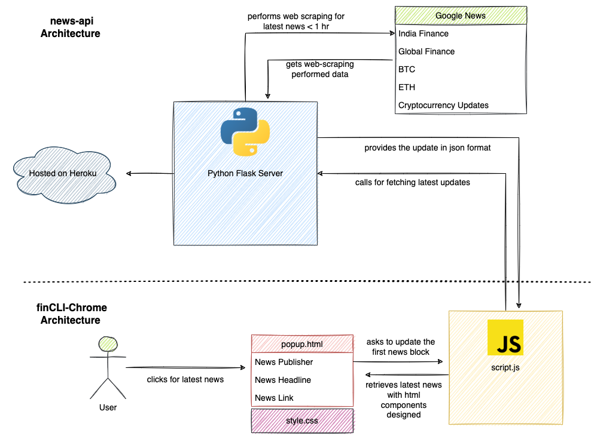

# finCLI-Chrome 🚧

[finCLI](https://github.com/dhairyaostwal/finCLI) started in March,2020 as it's first release providing latest Finance updates on Command Line Interface. There were more releases including the home grown [news-api](https://fincli-news-api.herokuapp.com/) which enables the efficient and fast functioning of fetching latest and credible news on the internet < 1 hour of publishing.

We wanted to build more usage relevance hence coming up with a Chrome Extension which gets the latest information on topics like Indian Finance, Global Finance and Cryptocurrency Updates.

<h1 align="center">
  

</h1>

## Architecture Diagram

<h1 align="center"></h1>

## Present Progress

<h1 align="center"></h1>

## Pending Work

1. Launch on Chrome Store
2. `HTML-CSS Enhancement` Support multiple sections - crypto, global finance 

## Before you leave

Hey! I am Dhairya Ostwal, a CSE undergrad from India. 

Let's connect on 

  

**Star the repo ⭐️ if you like 😄**
